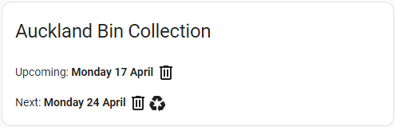

# Auckland Bin Collection for Home Assistant

A Home Assistant custom component grep the rubbish and recycle (food scraps soon!) bin collection date from Auckland Council website. User can make use of it to develop their own auotmation or notification.

## Installation

### HACS

If you have [HACS](https://hacs.xyz/) setup in your Home Assistant, go to the HACS integration page, click the 3 dots menu on top right corner and choose Custom repositories. Add [this repository](https://github.com/fishy242/auckland_bin_collection) with Category set to Integration. After that you can download the integration.

### Manual Install

Copy the `auckland_bin_collection` folder from the [`custom_components`](https://github.com/fishy242/auckland_bin_collection/tree/master/custom_components) and put this into `config/custom_components` of your Home Assistant setup.

## Setup

This integration supports UI setup. Add the integration in Home Assistant Integrations settings page. Click the ADD INTEGRATION button and search for "Auckland Bin Collection".

### Location ID

To setup, you need the location ID of the address where you want to retrieve the bin collection date for. You can find the location ID from [Auckland Council Collection Day](https://www.aucklandcouncil.govt.nz/rubbish-recycling/rubbish-recycling-collections/Pages/rubbish-recycling-collection-days.aspx) webpage. Enter a full address in the webpage, then you will be directed to a page showing the collection day of the address you entered. Look into the URL of this page, the location ID is the 11 digits at the end of the URL. Enter this location ID when you are prompt during setup.

### Sensor Entity

Two sensor entities will be created after setup. `sensor.auckland_bin_collection_upcoming` contains the information of the upcoming collection day. `sensor.auckland_bin_collection_next` contains the information of the next colllection day afterward.

## Usage

### State

The state of the sensor is the date of the collection day.

### Attributes

The table below shows the attributes of the sensor.
| Attribute | Content |
|-----------|---------|
| location_id | Location ID of the location that the sensor referring to. |
| date | Date string retrieve from the Auckland Council webpage. |
| rubbish | `true` or `false` - Rubbish bin will be collected or not. |
| recycle | `true` or `false` - Recycle bin will be collected or not. |
| query_url | The URL where the information retrieved from. |
| friendly_name | Sensor's friendly name. |

## Example Usage

You can add a Markdown Card on your Home Assistant Dashboard with the following content:

```
Upcoming: **{{ state_attr('sensor.auckland_bin_collection_upcoming', 'date') }}** <ha-icon icon="mdi:trash-can-outline"></ha-icon> <ha-icon icon="mdi:recycle"></ha-icon>

Next:  **{{ state_attr('sensor.auckland_bin_collection_next', 'date') }}** <ha-icon icon="mdi:trash-can-outline"></ha-icon><ha-icon icon="mdi:recycle"></ha-icon>
```

Result will look like this.



You can also make your own automation base on the state and attributes, e.g. send a notification to the Home Assistant App when the collection day comes.

Hope you find this integration useful :)
