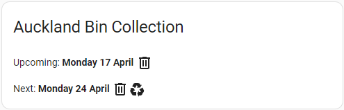

# Auckland Bin Collection for Home Assistant

A Home Assistant custom component grep the rubbish and recycle (food scraps soon!) bin collection date from Auckland Council website. User can make use of it to develop their own auotmation or notification.

## Version

| Version | Notes                                                                  |
| ------- | ---------------------------------------------------------------------- |
| 0.1.0   | First publish release                                                  |
| 0.2.0   | Update with Auckland Council website to include food scraps collection |
| 0.3.0   | Added native Calendar entity and optimized polling frequency           |

## Installation

### HACS

If you have [HACS](https://hacs.xyz/) setup in your Home Assistant, go to the HACS integration page, click the 3 dots menu on top right corner and choose Custom repositories. Add [this repository](https://github.com/fishy242/auckland_bin_collection) with Category set to Integration. After that you can download the integration.

### Manual Install

Copy the `auckland_bin_collection` folder from the [`custom_components`](https://github.com/fishy242/auckland_bin_collection/tree/master/custom_components) and put this into `config/custom_components` of your Home Assistant setup.

## Setup

This integration supports UI setup. Add the integration in Home Assistant Integrations settings page. Click the ADD INTEGRATION button and search for "Auckland Bin Collection".

### Location ID

To setup, you need the location ID of the address where you want to retrieve the bin collection date for. You can find the location ID from [Auckland Council Collection Day](https://www.aucklandcouncil.govt.nz/rubbish-recycling/rubbish-recycling-collections/Pages/rubbish-recycling-collection-days.aspx) webpage. Enter a full address in the webpage, then you will be directed to a page showing the collection day of the address you entered. Look into the URL of this page, the location ID is the 11 digits at the end of the URL. Enter this location ID when you are prompt during setup.

### Entities Created

Upon successful setup, a natively integrated **Calendar Entity** (`calendar.auckland_bin_collection`) will be created. This is the primary and recommended way to interact with the integration going forward.

> [!WARNING]
> The two legacy sensor entities (`sensor.auckland_bin_collection_upcoming` and `sensor.auckland_bin_collection_next`) are **deprecated** and will be removed in a future release. Please begin moving your automations over to the Calendar entity.

## Usage

### Calendar Entity

The calendar entity cleanly separates each bin collection type into its own discrete, all-day calendar event (e.g., an individual "Rubbish" event and an individual "Recycling" event on the same day). This allows you to write precise, condition-based automations using Home Assistant's native calendar features.

### Sensor State (Deprecated)

The state of the sensor is the date of the collection day.

### Attributes

The table below shows the attributes of the sensor.
| Attribute | Content |
|-----------|---------|
| location_id | Location ID of the location that the sensor referring to. |
| date | Date string retrieve from the Auckland Council webpage. |
| rubbish | `true` or `false` - Rubbish bin will be collected or not. |
| recycle | `true` or `false` - Recycle bin will be collected or not. |
| food scraps | `true` or `false` - Food scraps bin will be collected or not. |
| query_url | The URL where the information retrieved from. |
| friendly_name | Sensor's friendly name. |

### Automation Example (Recommended)

Since the calendar generates multiple events per day (one for each bin type), triggering purely on the calendar event start will cause multiple actions to fire. 

To receive a **single daily digest notification**, trigger your automation at a specific time and use `calendar.get_events` to retrieve all scheduled bins for that day:

```yaml
alias: "Daily Bin Reminder"
mode: single
trigger:
  # Check at 7:00 AM every day
  - platform: time
    at: "07:00:00" 
action:
  # Fetch all events occurring in the next 24 hours
  - service: calendar.get_events
    target:
      entity_id: calendar.auckland_bin_collection
    data:
      duration:
        hours: 24
    response_variable: scheduled_bins

  # STOP execution if no bins are scheduled today
  - condition: template
    value_template: "{{ scheduled_bins['calendar.auckland_bin_collection']['events'] | length > 0 }}"

  # Send exactly one notification summarizing all bins
  - service: notify.notify
    data:
      message: >
        Take out the bins today:
        
          - {{ event.summary }}
        
```

### Dashboard Card (Legacy Sensor)

If you are still using the deprecated sensors, you can add a Markdown Card on your Home Assistant Dashboard with the following content:

```
Upcoming: **{{ state_attr('sensor.auckland_bin_collection_upcoming', 'date') }}** <ha-icon icon="mdi:trash-can-outline"></ha-icon> <ha-icon icon="mdi:recycle"></ha-icon> <ha-icon icon="mdi:compost"></ha-icon>

Next:  **{{ state_attr('sensor.auckland_bin_collection_next', 'date') }}** <ha-icon icon="mdi:trash-can-outline"></ha-icon><ha-icon icon="mdi:recycle"></ha-icon> <ha-icon icon="mdi:compost"></ha-icon>
```

Result will look like this.



Hope you find this integration useful :)
